# Memory System v2 - Data Flow Analysis

## Sequence Diagram

```mermaid
sequenceDiagram
    participant User
    participant HostApp as Host App<br/>(chat.py)
    participant LLM as Claude LLM
    participant MemorySystem as Memory System<br/>(memory_tool)

    Note over HostApp: Initialization
    HostApp->>HostApp: Load .env configuration
    HostApp->>MemorySystem: Initialize(root=/memories)
    MemorySystem-->>HostApp: Ready
    HostApp->>HostApp: Load [system_prompt.txt]
    Note over HostApp: System prompt defines<br/>autonomous memory behavior

    rect rgb(200, 220, 255)
        Note over User,MemorySystem: CONVERSATION TURN 1: User says "hello"

        User->>HostApp: "hello"
        HostApp->>HostApp: messages.append(user: "hello")

        HostApp->>LLM: POST /messages<br/>system: [system_prompt]<br/>tools: [memory_tool]<br/>messages: [user: "hello"]

        Note over LLM: Claude decides to check<br/>what memories exist

        LLM->>MemorySystem: tool_call: view(path="/memories")
        activate MemorySystem
        MemorySystem->>MemorySystem: List directory /memories
        MemorySystem-->>LLM: tool_result: ["user_preferences.txt"]
        deactivate MemorySystem

        Note over LLM: Claude wants to read<br/>user preferences

        LLM->>MemorySystem: tool_call: view(path="/memories/user_preferences.txt")
        activate MemorySystem
        MemorySystem->>MemorySystem: Read file content
        MemorySystem-->>LLM: tool_result: [file_content]<br/>"User Preferences<br/>Favorite color: blue<br/>Writer: Non-fiction..."
        deactivate MemorySystem

        Note over LLM: Has context, ready to respond

        LLM-->>HostApp: response: "Hello! It's great to hear<br/>from you again. How are you doing?<br/>Are you still at the beach..."
        HostApp->>HostApp: messages.append(assistant: response)
        HostApp-->>User: Display response
    end

    rect rgb(220, 255, 220)
        Note over User,MemorySystem: CONVERSATION TURN 2: User mentions new project

        User->>HostApp: "still at the beach, I'd like to start<br/>a new dedicated project..."
        HostApp->>HostApp: messages.append(user: message)

        HostApp->>LLM: POST /messages<br/>system: [system_prompt]<br/>tools: [memory_tool]<br/>messages: [full_history]

        Note over LLM: Check existing memories first

        LLM->>MemorySystem: tool_call: view(path="/memories")
        MemorySystem-->>LLM: tool_result: ["user_preferences.txt"]

        LLM->>MemorySystem: tool_call: view(path="/memories/user_preferences.txt")
        MemorySystem-->>LLM: tool_result: [current_content]

        Note over LLM: Decides to create new<br/>project tracking file

        LLM->>MemorySystem: tool_call: create(<br/>  path="/memories/project_solo_entrepreneur_app.txt",<br/>  file_text="Solo Entrepreneur Management Web App<br/>  Started: 2025-11-07<br/>  Project Description: A web app...<br/>  To-Do List:<br/>  [ ] Define core features..."<br/>)
        activate MemorySystem
        MemorySystem->>MemorySystem: Create new file
        MemorySystem->>MemorySystem: Log: Created /memories/project_solo_entrepreneur_app.txt<br/>Lines: 25 | Characters: 624
        MemorySystem-->>LLM: tool_result: "✓ Created memory file"
        deactivate MemorySystem

        Note over LLM: Also update user preferences<br/>to reference new project

        LLM->>MemorySystem: tool_call: str_replace(<br/>  path="/memories/user_preferences.txt",<br/>  old_string="Current Projects...",<br/>  new_string="Current Projects...<br/>  - Solo Entrepreneur Management Web App"<br/>)
        activate MemorySystem
        MemorySystem->>MemorySystem: Find and replace string
        MemorySystem->>MemorySystem: Log: Replaced string<br/>Old: "Current Projects..."<br/>New: "Current Projects... - Solo..."
        MemorySystem-->>LLM: tool_result: "✓ Replaced string"
        deactivate MemorySystem

        LLM-->>HostApp: response: "Excellent! I've created a dedicated<br/>project file for your new Solo<br/>Entrepreneur Management Web App..."
        HostApp->>HostApp: messages.append(assistant: response)
        HostApp-->>User: Display response
    end

    rect rgb(255, 220, 220)
        Note over User,MemorySystem: CONVERSATION TURN 3: User defines MVP features

        User->>HostApp: "Let's catalog the features for the MVP,<br/>TimeTracking (with client rolodex)..."
        HostApp->>HostApp: messages.append(user: message)

        HostApp->>LLM: POST /messages<br/>system: [system_prompt]<br/>tools: [memory_tool]<br/>messages: [full_history]

        Note over LLM: Tries wrong filename first<br/>(shows autonomous error recovery)

        LLM->>MemorySystem: tool_call: str_replace(<br/>  path="/memories/solo_entrepreneur_app_project.md",<br/>  ...<br/>)
        activate MemorySystem
        MemorySystem->>MemorySystem: Check if file exists
        MemorySystem-->>LLM: tool_result: ERROR<br/>"File not found: /memories/solo_entrepreneur_app_project.md"
        deactivate MemorySystem

        Note over LLM: Recovers by checking<br/>what files actually exist

        LLM->>MemorySystem: tool_call: view(path="/memories")
        MemorySystem-->>LLM: tool_result: ["user_preferences.txt",<br/>"project_solo_entrepreneur_app.txt"]

        LLM->>MemorySystem: tool_call: view(<br/>  path="/memories/project_solo_entrepreneur_app.txt"<br/>)
        MemorySystem-->>LLM: tool_result: [current_file_content]

        Note over LLM: Now updates correct file<br/>with MVP features

        LLM->>MemorySystem: tool_call: str_replace(<br/>  path="/memories/project_solo_entrepreneur_app.txt",<br/>  old_string="To-Do List...",<br/>  new_string="MVP Features<br/>1. Time Tracking...<br/>2. Client Rolodex...<br/>3. Dashboard..."<br/>)
        activate MemorySystem
        MemorySystem->>MemorySystem: Replace to-do list with MVP features
        MemorySystem-->>LLM: tool_result: "✓ Replaced string"
        deactivate MemorySystem

        LLM-->>HostApp: response: "Perfect! I've updated the project<br/>file with your MVP features..."
        HostApp->>HostApp: messages.append(assistant: response)
        HostApp-->>User: Display response
    end

    Note over HostApp,MemorySystem: Loop continues for each user message...<br/>Claude autonomously decides when to<br/>read/write/update memories
```



## Decision Log

This table shows the chronological progression of user inputs and the LLM's autonomous decisions during the conversation captured in the debug log.

| Time | User Input | LLM Decisions | Outcome |
|------|------------|---------------|---------|
| **13:44:14** | `"hello"` | 1. View memories directory | Found 2 items in memory |
| **13:45:28** | `"hello"` | 1. View memories directory<br/>2. View `user_preferences.txt` | Retrieved user context (beach location, writing projects, preferences). Generated personalized greeting asking about beach. |
| **13:45:49** | `"still at the beach, I'd like to start a new dedicated project, and want to keep track of the todos for it. This will be a new web app that assists entreprenures (solo) with managing their responsibiliteis"` | 1. View memories directory<br/>2. View `user_preferences.txt`<br/>3. **Create** `project_solo_entrepreneur_app.txt` with project description and initial to-do list<br/>4. **Update** `user_preferences.txt` to add project to "Current Projects" section | New project tracking file created (25 lines, 624 chars). User preferences updated with project reference. Confirmed creation to user. |
| **13:47:47** | `"Let's catalog the features for the MVP, TimeTracking (with a client rolodex), dashboard to record company metadata"` | 1. ~~Update wrong file~~ `solo_entrepreneur_app_project.md` → **ERROR: File not found**<br/>2. **Recovery**: View memories directory<br/>3. View `project_solo_entrepreneur_app.txt`<br/>4. **Update** project file, replacing "To-Do List" section with structured "MVP Features" (Time Tracking, Client Rolodex, Dashboard) | Demonstrated autonomous error recovery. Successfully updated project file with MVP feature catalog. |

### Key Observations

**Autonomous Behavior:**
- LLM proactively checks memory context before responding (no explicit instruction to do so)
- Creates structured project tracking without being told the format
- Self-recovers from errors by exploring the memory structure

**Memory Management Strategy:**
- Always views directory first to understand current state
- Reads existing files before modifying them
- Updates related files to maintain consistency (e.g., both project file AND user preferences)

**Decision Patterns:**
1. **Context gathering** → View memories to understand what's saved
2. **Information synthesis** → Read relevant files to build context
3. **Proactive organization** → Create structured files for new information
4. **Cross-referencing** → Update multiple files to maintain relational integrity

## Key Data Flow Points

### 1. **What Triggers Memory Files to be Read?**

Claude (the LLM) autonomously decides when to read memory files based on:

- **Initial context gathering**: When a conversation starts, Claude typically calls `view("/memories")` to see what memories exist
- **Relevance to user query**: If the user mentions something that might have been saved (names, projects, preferences), Claude proactively reads relevant files
- **Before writing**: Claude often reads existing files before updating them to understand current state
- **Error recovery**: When a tool call fails, Claude will read to discover correct file paths/structure

**From the logs:**
```
13:45:34 - memory_tool - DEBUG - [MEMORY] view() called: path=/memories
13:45:37 - memory_tool - DEBUG - [MEMORY] view() called: path=/memories/user_preferences.txt
```

### 2. **When is Memory File Content Sent to the LLM?**

Memory content flows to the LLM in two ways:

#### A. **Indirectly via System Context**
The system prompt is sent with EVERY request:
```
System prompt: You are a helpful assistant with persistent memory capabilities...
```

#### B. **Directly via Tool Results**
When Claude calls `memory_tool.view()`, the file content is returned as a tool result and added to the message history:

```python
# Flow:
1. LLM → tool_call: view(path="/memories/user_preferences.txt")
2. Memory System → reads file content
3. Memory System → returns: "User Preferences\n=================\n\nFavorite color: blue..."
4. Host App → adds to messages as tool_result
5. Host App → sends updated messages back to LLM
```

**From the logs:**
```
13:45:37 - memory_tool - DEBUG - [MEMORY] Loaded file: /memories/user_preferences.txt
13:45:37 - memory_tool - DEBUG - [MEMORY]   Content preview: User Preferences...Favorite color: blue...
```

### 3. **What Directives Come Back from the LLM?**

The LLM can return two types of responses:

#### A. **Tool Use Requests** (Directives to Memory System)

These are JSON-structured commands that the Host App executes locally:

| Directive | Purpose | Example from Logs |
|-----------|---------|-------------------|
| `view(path, view_range)` | Read file or list directory | `view(path="/memories")` |
| `create(path, file_text)` | Create new memory file | `create(path="/memories/project_solo_entrepreneur_app.txt", file_text="...")` |
| `str_replace(path, old_string, new_string)` | Update existing file | `str_replace(path="/memories/user_preferences.txt", old_string="Current Projects...", new_string="...")` |
| `insert(path, insert_line, new_str)` | Insert at line number | Not used in this log |
| `delete(path)` | Delete file/directory | Not used in this log |
| `rename(old_path, new_path)` | Move/rename file | Not used in this log |

**Example from logs:**
```
13:46:01 - memory_tool - DEBUG - [MEMORY] create() called: path=/memories/project_solo_entrepreneur_app.txt
13:46:04 - memory_tool - DEBUG - [MEMORY] str_replace() called: path=/memories/user_preferences.txt
```

#### B. **Text Responses** (for User Display)

After executing any needed tool calls, Claude returns conversational text:

```
"Hello! It's great to hear from you again. How are you doing?
Are you still at the beach working on your writing, or have you returned home?"
```

### 4. **Complete Request/Response Cycle**

Each turn follows this pattern:

```
┌─────────────────────────────────────────────────────────────────┐
│ Host App → LLM REQUEST                                         │
├─────────────────────────────────────────────────────────────────┤
│ {                                                              │
│   "model": "claude-sonnet-4-5-20250929",                      │
│   "system": [system_prompt],                                  │
│   "tools": [memory_tool_definition],                          │
│   "messages": [                                               │
│     {"role": "user", "content": "hello"},                     │
│     {"role": "assistant", "content": "...", "tool_use": ...}, │
│     {"role": "user", "content": "tool_result: ..."},          │
│     ...                                                        │
│   ]                                                            │
│ }                                                              │
└─────────────────────────────────────────────────────────────────┘
                              ↓
┌─────────────────────────────────────────────────────────────────┐
│ LLM → RESPONSE (May contain multiple tool calls)              │
├─────────────────────────────────────────────────────────────────┤
│ {                                                              │
│   "content": [                                                 │
│     {                                                          │
│       "type": "tool_use",                                      │
│       "name": "memory",                                        │
│       "input": {                                               │
│         "command": "view",                                     │
│         "path": "/memories/user_preferences.txt"              │
│       }                                                        │
│     }                                                          │
│   ],                                                           │
│   "stop_reason": "tool_use"                                    │
│ }                                                              │
└─────────────────────────────────────────────────────────────────┘
                              ↓
┌─────────────────────────────────────────────────────────────────┐
│ Host App → Execute Tool Locally                               │
├─────────────────────────────────────────────────────────────────┤
│ memory_tool.view(path="/memories/user_preferences.txt")       │
│ → Returns: "User Preferences\n================\n..."         │
└─────────────────────────────────────────────────────────────────┘
                              ↓
┌─────────────────────────────────────────────────────────────────┐
│ Host App → LLM REQUEST (with tool result)                     │
├─────────────────────────────────────────────────────────────────┤
│ {                                                              │
│   "messages": [                                                │
│     ...(previous messages)...,                                 │
│     {                                                          │
│       "role": "user",                                          │
│       "content": [                                             │
│         {                                                      │
│           "type": "tool_result",                               │
│           "content": "User Preferences\n================\n..." │
│         }                                                      │
│       ]                                                        │
│     }                                                          │
│   ]                                                            │
│ }                                                              │
└─────────────────────────────────────────────────────────────────┘
                              ↓
┌─────────────────────────────────────────────────────────────────┐
│ LLM → FINAL TEXT RESPONSE                                     │
├─────────────────────────────────────────────────────────────────┤
│ {                                                              │
│   "content": [                                                 │
│     {                                                          │
│       "type": "text",                                          │
│       "text": "Hello! It's great to hear from you again..."    │
│     }                                                          │
│   ],                                                           │
│   "stop_reason": "end_turn"                                    │
│ }                                                              │
└─────────────────────────────────────────────────────────────────┘
                              ↓
                        Display to User
```

## Summary

### Memory Read Triggers
✅ **Autonomous LLM decision** - Claude decides when context is needed
✅ **Conversation start** - Usually checks what memories exist
✅ **User mentions past context** - Proactively recalls relevant info
✅ **Before updates** - Reads current state before modifying

### Memory Content to LLM
✅ **System prompt** - Sent with every request
✅ **Tool results** - File contents returned after `view()` calls
✅ **Previous tool operations** - Full message history includes all past tool calls/results

### LLM Directives Back
✅ **Tool calls** - Structured commands: view, create, str_replace, insert, delete, rename
✅ **Text responses** - Conversational replies to display to user
✅ **Multiple operations** - Can chain multiple tool calls before responding
✅ **Error handling** - If tool fails, LLM sees error and can recover autonomously

The beauty of this system is the **tool_runner** abstraction - the Host App doesn't manually parse or route anything. It just:
1. Sends request with available tools
2. Executes whatever tool calls come back
3. Feeds results back to LLM
4. Repeats until LLM returns text
5. Displays text to user
